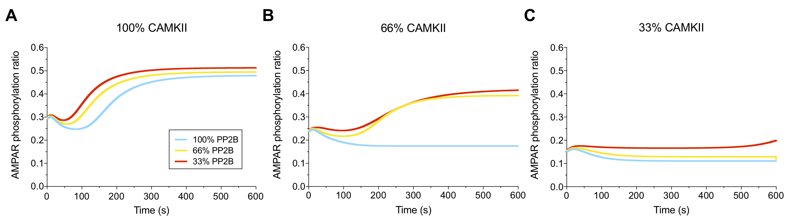

# Multiscale-Synaptic-Model Figure 7

## Figure

## Components

- **C\*P\* folders** 
	Here C means CaMKII and P means PP2B. 1 means 100%, 2 means 2/3, 3 means 1/3. In each of these folders, there is a COPASI model in its chemical equilibrium under the setting of resting MVN Type B neurons. A H + VS stimulation output is in each folder, and with the SetupFolder.py, a COPASI model embeded with the Ca dynamics during H+VS was in I=0EH-0.475Last=250_Normal_C folder.

- **outputs/\*.txt** 
	outputs from NEURON model from Figure 4, which records the Ca dynamics with and without hyperpolarisation of high, low LVA neurons.

- **SetupFolders.py** 
	Python script that takes in all the \*.txt in the current folder as the stimulation protocol and one \*.cps as the initial model, and output a sub-folder with new COPASI model that emmbeded the Ca dynamics into the initial COPASI model.

- **chemical_extract_batch_info.py**  
	Python sctipt that extract information from COPASI output and does plotting.

## Instruction

1. Go into the \*\_C folders, running the COPASI files inside allows you to get the molecular dynmaics under the given the electraical stimulation.
